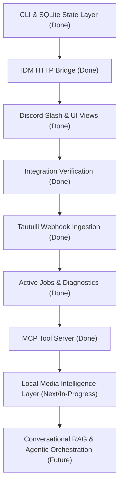

# Adapter Roadmap: Media Bot

This document outlines the current state and planned progression of integrations and interfaces for the `media-bot` ecosystem.

---

## 🗺️ Progression Stages

---

## 🛠️ Status Details

### Stage 1: Core CLI & Database [COMPLETED]
* Exposes the system via `python -m moviebot.cli.tool_cli`.
* Persists Plex library mirrors, search indices, and download jobs in SQLite.

### Stage 2: Host Bridge Listener [COMPLETED]
* Exposes the PowerShell endpoint at `127.0.0.1:8765` on the Windows host.
* Enables containerized Python code to trigger native Windows IDM processes safely.

### Stage 3: Discord Slash & UI Views [COMPLETED]
* Integrates Discord UI components (Buttons, Selection dropdowns) to resolve torrent ambiguity.
* Provides slash command interaction boundaries (`/search`, `/check`, `/sync`).

### Stage 4: Integration Verification [COMPLETED]
* Validating debrid cached links, Plex media sweeps, and indexer fetching using real tokens.

### Stage 5: Tautulli Event Listeners [COMPLETED]
* Automatically sync Plex state mirror when users finish watching movies or when items are added to Plex.

### Stage 6: Active Jobs, Pending Job Resolution, and Diagnostics [COMPLETED]
* Implement active/recent job listing, automated background polling to resolve pending torrents, and error diagnostics tools.

### Stage 8: Model Context Protocol (MCP) Wrapper [COMPLETED]
* Package the standardized JSON tools into an MCP server definition to let AI agents run searches and check libraries autonomously.

### Stage 7: Local Media Intelligence Layer [IN PROGRESS]
* Evolve the Plex mirror database into a hybrid metadata and discovery engine containing normalized metadata (genres, directors, rating, runtime, collections, resolution, watch status, watch metrics, synopsis, metadata hashes, and versioned synopsis vector embeddings).
* Build standard SQLite query filters (genre, director, duration, rating, watch status) and FTS5 virtual table indexing for exact keyword search.
* Integrate Google Gemini (free tier) and local Ollama embedding endpoints to retrieve 768-dimension synopsis vectors on sync, utilizing incremental caching to avoid duplicate API calls.
* Implement a fast, in-memory cosine-similarity vector calculation in Python for zero-latency semantic search queries.
* Implement a Tautulli-driven Taste Vector recommendation system and a Collection Gap Auditing utility with sequence gap logic.
* Add a dry-run-safe intelligence backfill command and refactor the download deduplication engine in a focused follow-up block to support conservative quality upgrades (resolution, size, bitrate).
* Implement three interactive Discord slash commands: `/library` (hybrid keyword/semantic lookup), `/recommend` (taste-vector curation), and `/audit` (series gaps with interactive button triggers to auto-search missing movies).

### Stage 9: Conversational RAG & Agentic Orchestration [FUTURE]
* Layer advanced semantic retrieval over the SQLite database using LLM APIs (Gemini, OpenAI, or local Ollama).
* Generate deep expert film profiles (craft, themes, director influences) and evaluate whether direct SQLite vector storage remains sufficient or a dedicated vector database is justified.
* Implement a 2-stage retrieval pipeline (fast pure-Python similarity matching, followed by conversational RAG ranking/explaining) with safety mitigations for local queueing, caching, rate limiting, and spoiler controls.
