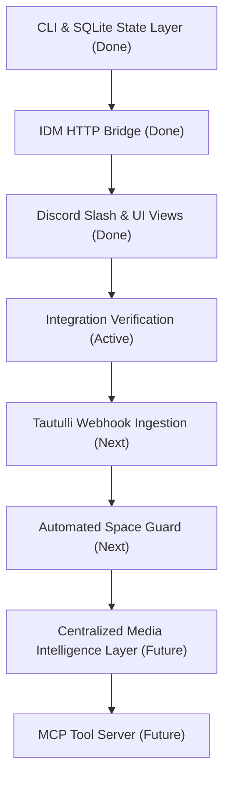

# Adapter Roadmap: Media Bot

This document outlines the current state and planned progression of integrations and interfaces for the `media-bot` ecosystem.

---

## 🗺️ Progression Stages

---

## 🛠️ Status Details

### Stage 1: Core CLI & Database [COMPLETED]
* Exposes the system via `python -m moviebot.cli.tool_cli`.
* Persists Plex library mirrors, search indices, and download jobs in SQLite.

### Stage 2: Host Bridge Listener [COMPLETED]
* Exposes the PowerShell endpoint at `127.0.0.1:8765` on the Windows host.
* Enables containerized Python code to trigger native Windows IDM processes safely.

### Stage 3: Discord Slash & UI Views [COMPLETED]
* Integrates Discord UI components (Buttons, Selection dropdowns) to resolve torrent ambiguity.
* Provides slash command interaction boundaries (`/search`, `/check`, `/sync`).

### Stage 4: Integration Verification [ACTIVE]
* Validating debrid cached links, Plex media sweeps, and indexer fetching using real tokens.

### Stage 5: Tautulli Event Listeners [PLANNED]
* Automatically sync Plex state mirror when users finish watching movies or when items are added to Plex.

### Stage 6: Space Management Guard [PLANNED]
* Script to monitor `F:\_temp\movies` space usage and delete older watched files if thresholds are exceeded.

### Stage 7: Centralized Media Intelligence Layer [FUTURE]
* Evolve the Plex mirror database into an authoritative local knowledge base ("Media Intelligence Layer") containing normalized metadata for all owned media items (IMDb/TMDb IDs, GUIDs, genres, runtime, watch status, quality, file paths, etc.) for instant local querying.
* Layer advanced retrieval strategies starting with SQLite FTS5 for lightweight semantic-style search, then optional vector embeddings and a vector database (e.g., Qdrant) for conversational and "taste-aware" recommendations using LLM-generated enrichment profiles.
* Unify the discovery/recommendation layer with the torrent acquisition layer (Prowlarr, AllDebrid, IDM) through this shared database, enabling the bot to reason holistically about owned items, active downloads, versions, and watch habits.

### Stage 8: Model Context Protocol (MCP) Wrapper [FUTURE]
* Package the standardized JSON tools into an MCP server definition to let AI agents run searches and check libraries autonomously.
