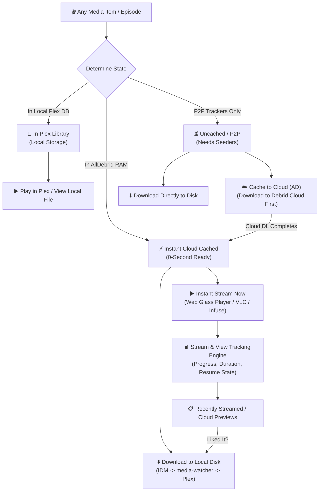

# Block 5.4: 3-Tier Media Lifecycle, Cloud Pre-Caching & Instant Streaming Player

## 🎯 Goal
Implement a universal **3-Tier Media State Lifecycle** across the entire application (`In Plex` vs `⚡ Instant Cached` vs `⏳ Uncached P2P`), enable instant in-browser cloud media streaming, 1-click desktop player launchers (`VLC`, `Infuse`, `PotPlayer`), cloud pre-caching for uncached torrents, and real-time viewing history & progress tracking.

---

## 📌 Context & Architecture
Every piece of media across the entire ecosystem (Discovery, Search, Pre-warmed Cache, TV Episode Manifest, History) is explicitly classified into one of three operational states:

---

## 📋 Completed Deliverables

### 1. Unified 3-State Media Badging & Action Workflow
- **`📁 In Plex Library`**: Local & owned $\rightarrow$ `▶️ Play in Plex` / File Info.
- **`⚡ Instant Cloud Cached`**: 0-second ready $\rightarrow$ `▶️ Stream Now` (Primary) + `⬇️ Grab to Disk` (Secondary).
- **`⏳ Uncached / P2P`**: Trackers only $\rightarrow$ `☁️ Cache to Cloud (AD)` (Primary) + `⬇️ Queue Download`.

### 2. Backend Streaming & Cloud Pre-Caching REST Endpoints (`/api/stream/*`, `/api/cloud/*`)
- `POST /api/stream/unlock`: Resolves direct high-speed HTTPS stream URL, filename, filesize, mime-type, multi-file track list, and auto-loads previous playback resume point.
- `POST /api/stream/progress`: Real-time player heartbeat persisting playback seconds, total duration, and completion status into SQLite `stream_history`.
- `GET /api/stream/history`: Chronological stream history with resume points and completion indicators.
- `DELETE /api/stream/history/{id}`: Deletes viewing records.
- `POST /api/cloud/pre-cache`: Enqueues uncached P2P magnet to AllDebrid cloud downloader, tracking it in `prewarmed_cache` as origin `cloud_precache`.
- `GET /api/cloud/transfers`: Inspects active AllDebrid cloud download queue and speeds.

### 3. Glassmorphic Video Player Modal & Desktop Player Launchers
- Embedded HTML5 video player modal with loading overlay, track selector for multi-file packs, and auto-resume.
- **1-Click External Player Launchers**:
  - `🚀 Open in local VLC` (the local Media Bot host launches VLC with the current HTTPS stream URL)
  - `🍎 Open in Infuse` (`infuse://<stream_url>`)
  - `🎬 Open in PotPlayer / IINA` (`potplayer://<stream_url>`)
  - `📋 Copy Stream URL`
  - `⬇️ Download to Local Disk` (Direct grab to Plex inside player header).
- Global keyboard shortcuts: `Space` (Play/Pause), `Left`/`Right` (Seek $\pm$10s), `F` (Fullscreen), `Esc` (Close).

### 4. Cloud Stream History & Previews UI Subview
- New **"▶️ Cloud Streams / Previews"** subtab in the History tab showing all previewed cloud media with progress bars (e.g. `[=====> ] 45% (32:10 / 1:12:00)`), timestamp in EST, and 1-click `⬇️ Grab to Plex` action.

---

## 🧪 Verification Plan

- `tests/test_stream_unlock.py`: 100% pass (repository lifecycle, AllDebrid mock unlock, cloud pre-caching, progress heartbeat, delete).
- Full test suite: 312 / 312 tests passing.
