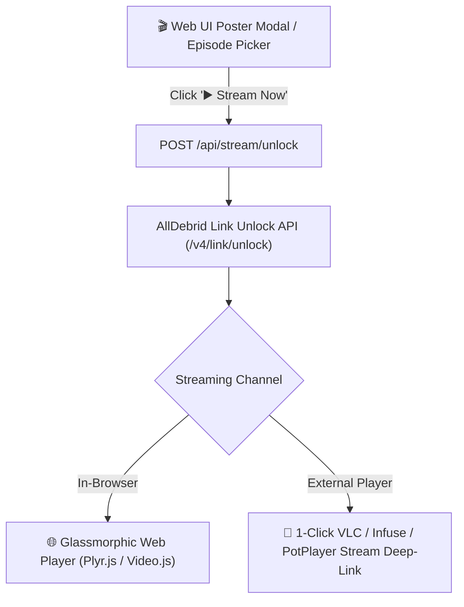

# Block 5.4: Web UI Instant Cloud Streaming & Media Player

## 🎯 Goal
Enable instant in-browser media streaming and 1-click desktop player launching (`VLC`, `Infuse`, `PotPlayer`) for any AllDebrid instant-cached (`⚡ Lightning`) releases directly from the Web UI Cockpit without waiting for files to download locally.

---

## 📌 Context & Architecture
When a torrent is marked as `⚡ Instant Cache` on AllDebrid, AllDebrid can generate a direct high-speed HTTPS stream URL in milliseconds.

---

## 📋 Key Deliverables

### 1. Backend REST Endpoint (`/api/stream/unlock`)
- Accepts `magnet_url` or `torrent_link` (and optional `file_id` for multi-file TV season packs).
- Unlocks the file via `AllDebridClient.unlock_link()`.
- Returns direct HTTPS stream URL, mime-type, resolution, audio streams, and available subtitle tracks.
- Gracefully handles non-cached torrents (returns `cached: false` with prompt to enqueue download instead).

### 2. Embedded In-Browser Video Player Modal
- Glassmorphic modal overlay using `Plyr.js` or lightweight HTML5 / HLS.js player.
- Controls: Play/Pause, 10s Seek Forward/Back, Volume, Fullscreen, Speed Controls (0.75x to 2x).
- Subtitles toggle with auto-loading embedded `.srt` / `.vtt` tracks or external subtitle fetching.
- Cinema Mode / Theater Mode toggle.

### 3. Desktop Player 1-Click Launchers
- `🚀 Open in VLC` (`vlc://<stream_url>`)
- `🍎 Open in Infuse` (`infuse://<stream_url>`)
- `🎬 Open in IINA / PotPlayer`
- Direct `.m3u8` / `.strm` stream file download.

### 4. TV Season / Episode Instant Stream Picker
- For TV series packs, allow picking and streaming individual episodes directly from the episode selection modal.

---

## 🧪 Verification Plan

1. **Automated Endpoint Tests:**
   - `test_api_stream_unlock_cached_movie()`: Mock AllDebrid unlock and verify returned stream URL.
   - `test_api_stream_unlock_uncached_fallback()`: Verify proper fallback response when torrent is not instant cached.
2. **Web UI Verification:**
   - Verify modal opens with `▶️ Stream Now` button when item has ⚡ Lightning badge.
   - Verify in-browser player loads and controls work smoothly.
