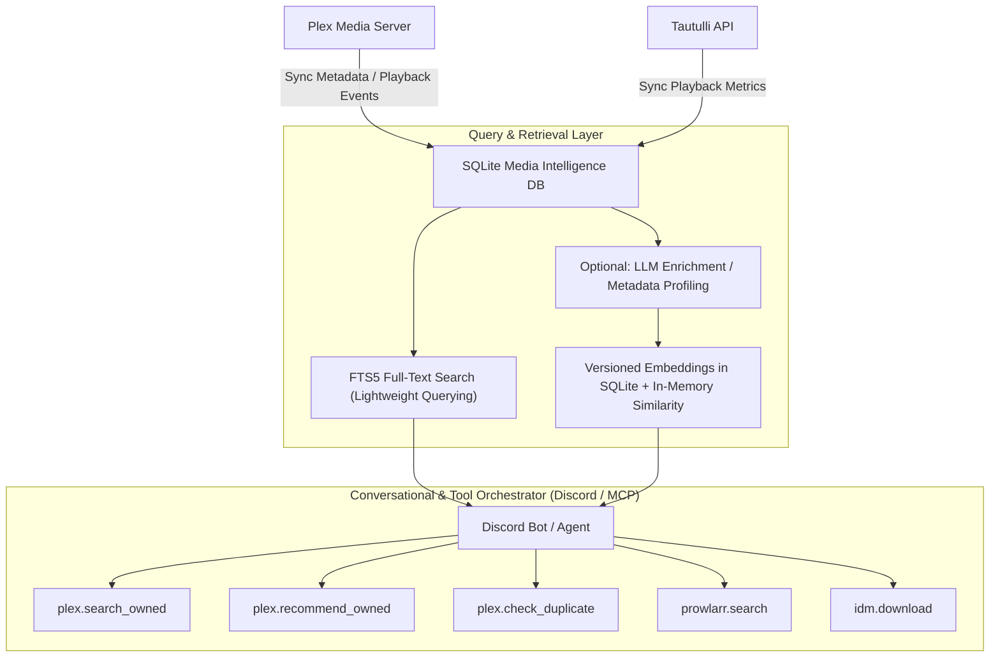

# Architectural Proposal: Centralized Media Intelligence Layer (Plex-RAG Evolution)

## Status
**Proposed / Future Roadmap**

---

## Context & Motivation

In previous phases, the SQLite database (`data/moviebot.sqlite3`) and the Plex adapter functioned primarily as a fast cache for duplicate detection during the torrent acquisition loop.

Drawing on insights from the `plex-rag` project, this proposal outlines the transition of that local database into a centralized **Media Intelligence Layer**. Instead of acting purely as a temporary cache, the local SQLite database should become the authoritative, rich local knowledge base containing normalized metadata for every owned media item. 

By unifying discovery, recommendation, and acquisition under a shared local database, the bot gains the ability to reason holistically about the user's media ecosystem:
- What is currently owned or in the library.
- What is actively downloading or queued.
- What versions/qualities exist and whether they should be upgraded (e.g., 1080p to 4K).
- What items are missing from tracked collections.
- What the user is statistically likely to enjoy based on watch histories.

---

## Proposed Architecture



---

## Technical Details

### 1. Extended Database Schema (`library_items`)
To support the Media Intelligence Layer, the `library_items` schema should be extended to store rich metadata locally:

```sql
CREATE TABLE library_items (
    id TEXT PRIMARY KEY,               -- Unique item ID
    source TEXT NOT NULL,              -- 'plex', 'tautulli', etc.
    rating_key TEXT,                   -- Plex rating key
    guid TEXT,                         -- Plex GUID
    imdb_id TEXT,                      -- IMDb identifier
    tmdb_id TEXT,                      -- TMDb identifier
    title TEXT NOT NULL,
    normalized_title TEXT NOT NULL,    -- Cleaned alphanumeric string for matching
    year INTEGER,
    genres TEXT,                       -- Comma-separated or JSON list of genres
    runtime INTEGER,                   -- Duration in minutes
    collections TEXT,                  -- JSON array of Plex collections containing this item
    watch_status TEXT,                 -- 'unwatched', 'in_progress', 'watched'
    watch_count INTEGER DEFAULT 0,
    quality TEXT,                      -- e.g., '2160p', '1080p', '720p', 'SD'
    file_path TEXT,
    size_bytes INTEGER,
    download_state TEXT,               -- 'owned', 'downloading', 'failed'
    updated_at TIMESTAMP DEFAULT CURRENT_TIMESTAMP
);
```

### 2. Multi-Stage Retrieval Strategy
Once media metadata exists in the local database, retrieval and discovery can be layered progressively:
1. **First Stage (SQLite FTS5)**: A virtual full-text search table (`library_items_fts`) mapping title, description, and genre fields to support extremely fast, lightweight prefix and keyword matching locally.
2. **Second Stage (Versioned Embeddings in SQLite)**: Generate synopsis/profile embeddings for library items and store them with model, dimension, hash, and update timestamps in SQLite. Phase 2 should use in-memory cosine similarity over the local library before adding a dedicated vector database. This enables early semantic search requests such as *"something like Blade Runner but less bleak"* without adding another service.
3. **Future Vector Store Evaluation**: If conversational RAG workloads or library scale outgrow SQLite plus in-memory similarity, evaluate a dedicated vector database such as Qdrant in Phase 3.

### 3. Unified Modular Tools
The Discord bot orchestrates user queries and commands over standard tool definitions, leveraging the unified SQLite mirror:
- **`plex.search_owned`**: Fast local query for title matching.
- **`plex.recommend_owned`**: Resolves "taste-aware" or collection-based recommendations.
- **`plex.check_duplicate`**: Compares incoming indexer items with local items, flagging upgrades if a higher quality version is found.
- **`prowlarr.search`**: Fetches indexer results if the item is not owned or is flagged for upgrade.
- **`alldebrid.add_magnet` / `idm.download`**: Initiates acquisition.
