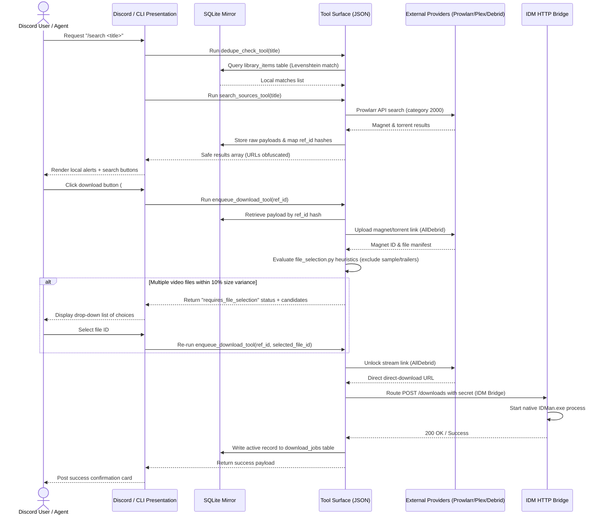

# Search, Deduplication, & Download Pipeline Flow

This document details the step-by-step path a media request takes from initial query to final IDM local queue enqueueing. Future agents must respect this flow when implementing updates.

---

## 🔄 The Pipeline Loop



---

## 🛠️ Verification Paths for Agents

To verify this flow programmatically without loading Discord:

1. **Query Local Mirror**:
   ```powershell
   py -3.8 -m moviebot.cli.tool_cli sync-library
   ```
2. **Perform Deduplication Check**:
   ```powershell
   py -3.8 -m moviebot.cli.tool_cli dedupe --title "The Matrix" --year 1999
   ```
3. **Trigger Prowlarr Search**:
   ```powershell
   py -3.8 -m moviebot.cli.tool_cli search --query "Matrix Resurrections"
   ```
4. **Trigger Flow (Dry Run)**:
   ```powershell
   py -3.8 -m moviebot.cli.tool_cli download --id "<obfuscated_ref_id>" --dry-run
   ```
5. **Query Watch History**:
   ```powershell
   py -3.8 -m moviebot.cli.tool_cli history --limit 5
   ```

---

## 📊 Watch History & Analytics Flow (Tautulli)

To support natural queries answering *"who watched what and when"*, the system exposes the Tautulli adapter logic:

1. **Parameters & Filtering**:
   The tool `query_watch_history_tool` handles filters for specific users (`--user`) or movie titles (`--query`).
2. **Generic API Gateway**:
   It issues calls to Tautulli's `get_history` API endpoint, translating raw Unix timestamps into formatted ISO datetime strings, and normalizing session percentages and media players.
3. **Structured Outputs**:
   The resulting schema returns a simplified list of logs detailing:
   * **`title`**: Movie or media item name.
   * **`user`**: The Plex account viewer.
   * **`date`**: ISO timestamp.
   * **`duration_minutes`**: Precise watching time.
   * **`player` & `media_type`**: Client device, resolution profiles, and category types.
